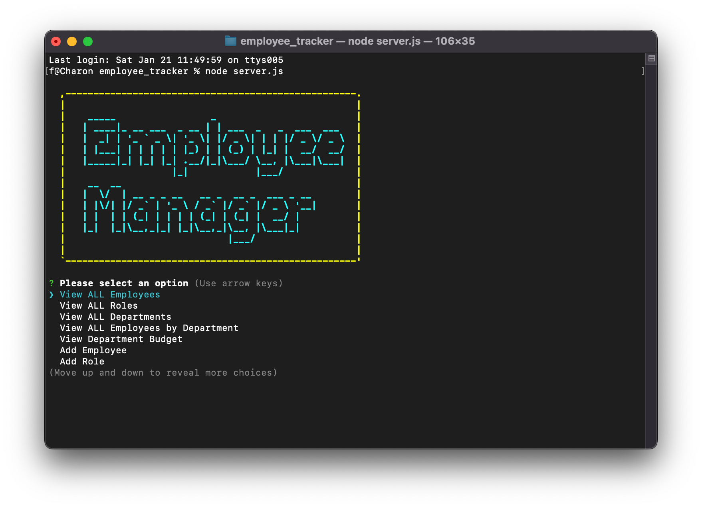

# Employee Tracker

## Description

Build a command line application to manage a company's employee database utilizing Node.js, Inquirer and MySQL. Ensure user is able to view all: employees, roles, departments, employee's by department and manager, department budget; be able to add/delete employee, role and department; update employee, employee role, and employee department.

## Table of Contents

- [Usage](#usage)
- [Installation](#installation)
- [Credits](#credits)
- [License](#license)
- [Badges](#badges)
- [Contribute](#how-to-contribute)

## Usage

Live on [Screencastify](https://drive.google.com/file/d/1UqeOlK6NXcTaBLVvpqDg1peiUvdau68v/view?usp=share_link)

## Installation

To run via local environment:

1.  Clone the repository

2.  Open terminal, and navigate to the appropriate directory

3.  From command line:

    - `npm init`
    - `npm install`

    Install the following dependencies:

    - mysql2 `npm install --save mysql2`
    - inquirer `npm install inquirer@8.2.4`
    - asciiart-logo `npm i asciiart-logo`
    - console.table `npm i console.table`

    Continue in command line:

    - `mysql -u root -p`
    - User will be prompted for password

    Once mysql is running

    - `source db/schema.sql;`
    - `source db/seeds.sql;`

    proceed to quit

    - `quit;`

4.  Finally type `node server.js`

## Credits

UT Web Development Bootcamp

## License

MIT License

Copyright (c) [2022] [fightingwards]

Permission is hereby granted, free of charge, to any person obtaining a copy
of this software and associated documentation files (the "Software"), to deal
in the Software without restriction, including without limitation the rights
to use, copy, modify, merge, publish, distribute, sublicense, and/or sell
copies of the Software, and to permit persons to whom the Software is
furnished to do so, subject to the following conditions:

The above copyright notice and this permission notice shall be included in all
copies or substantial portions of the Software.

THE SOFTWARE IS PROVIDED "AS IS", WITHOUT WARRANTY OF ANY KIND, EXPRESS OR
IMPLIED, INCLUDING BUT NOT LIMITED TO THE WARRANTIES OF MERCHANTABILITY,
FITNESS FOR A PARTICULAR PURPOSE AND NONINFRINGEMENT. IN NO EVENT SHALL THE
AUTHORS OR COPYRIGHT HOLDERS BE LIABLE FOR ANY CLAIM, DAMAGES OR OTHER
LIABILITY, WHETHER IN AN ACTION OF CONTRACT, TORT OR OTHERWISE, ARISING FROM,
OUT OF OR IN CONNECTION WITH THE SOFTWARE OR THE USE OR OTHER DEALINGS IN THE
SOFTWARE.

## Badges

